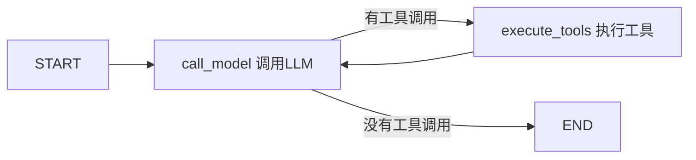

# 01 · 核心概念与最小示例

> 本文面向完全没接触过 LangGraph 的读者。读完你会：理解 6 个核心概念，
> 并能从零写出一个带「工具调用」的简易 Agent 图。

---

## 1. LangGraph 到底在干什么？

传统写 Agent 的方式是**手写循环**：

```python
# 伪代码：手写 Agent 循环
while True:
    response = llm.chat(messages)          # 1. 问 LLM
    if not response.tool_calls:            # 2. 没有工具调用 → 结束
        break
    result = run_tool(response.tool_calls) # 3. 执行工具
    messages.append(result)                # 4. 把结果回填给 LLM
    # 回到 1
```

这个循环逻辑没错，但一旦要加「最多 3 步」「重复调用就停」「流式输出每一步」，
`while` 循环里就会堆满 `if`，越来越难维护。

LangGraph 的思路：**把上面的循环画成一张图**。



图有节点（方框）、边（箭头）、条件（箭头上的判断），LangGraph 负责执行这张图：
走到哪、状态怎么传、循环怎么终止，都由框架管理。

> **一句话类比**：StateGraph 像一张地铁图，Node 是站点，Edge 是轨道，
> 条件边是「换乘规则」，State 是乘客随身携带的行李箱，每站都可以往箱子里放东西。

---

## 2. 六个核心概念

| 概念 | 英文 | 是什么 | 类比 |
|---|---|---|---|
| **状态** | State | 一个字典，图执行过程中共享的数据 | 随身行李箱 |
| **节点** | Node | 一个函数：读 State，返回要更新的部分 | 地铁站 |
| **边** | Edge | 节点 A 执行完 → 下一步固定去节点 B | 固定轨道 |
| **条件边** | Conditional Edge | 根据 State 内容决定下一步去哪个节点 | 换乘规则 |
| **合并规则** | Reducer | 多个节点写同一个字段时如何合并 | 行李箱打包规则 |
| **编译** | Compile | 把图结构变成可执行对象 | 拿到正式地铁图 |

### 2.1 State（状态）

State 是一个 `TypedDict`（带类型提示的字典），所有节点共享：

```python
from typing import TypedDict

class MyState(TypedDict):
    count: int          # 计数器
    notes: list[str]    # 笔记列表
```

### 2.2 Node（节点）

节点就是**普通函数**：输入整个 State，返回一个**字典**（要更新的字段）。
返回的字典会**覆盖** State 里同名字段（除非该字段有 Reducer）。

```python
def add_one(state: MyState) -> dict:
    return {"count": state["count"] + 1}   # 只返回要改的部分
```

### 2.3 Edge 与 Conditional Edge

```python
from langgraph.graph import StateGraph, START, END

graph = StateGraph(MyState)
graph.add_node("add_one", add_one)
graph.add_edge(START, "add_one")      # 固定边：入口 → add_one
graph.add_edge("add_one", END)        # 固定边：add_one → 结束
```

条件边：用一个「路由函数」决定下一步。路由函数输入 State，返回**目标节点名**：

```python
def route(state: MyState) -> str:
    return "add_one" if state["count"] < 3 else "end"

graph.add_conditional_edges(
    "add_one",
    route,                          # 路由函数
    {"add_one": "add_one", "end": END},   # 返回值 → 实际节点 的映射表
)
```

### 2.4 Reducer（合并规则）

如果两个节点都往 `notes` 里**追加**内容，默认「覆盖」就会互相抹掉。
给字段标注一个 Reducer 后，框架会用 Reducer 合并新旧值：

```python
import operator
from typing import Annotated, TypedDict

class MyState(TypedDict):
    notes: Annotated[list[str], operator.add]   # 追加而不是覆盖
```

`operator.add` 对列表就是「拼接」。**字段没有 Reducer = 覆盖；有 Reducer = 按规则合并**，
这是 LangGraph 最重要的一个细节，后面 03 篇会深入。

### 2.5 Compile（编译）

```python
app = graph.compile()   # 得到一个可执行对象（CompiledStateGraph）
```

---

## 3. 最小示例一：线性图（两个节点）

```python
"""线性图：START → node_a → node_b → END"""
from typing import TypedDict
from langgraph.graph import StateGraph, START, END

class MyState(TypedDict):
    message: str

def node_a(state: MyState) -> dict:
    print("→ node_a 执行")
    return {"message": state["message"] + "，来自 A"}

def node_b(state: MyState) -> dict:
    print("→ node_b 执行")
    return {"message": state["message"] + "，来自 B"}

graph = StateGraph(MyState)
graph.add_node("node_a", node_a)
graph.add_node("node_b", node_b)
graph.add_edge(START, "node_a")
graph.add_edge("node_a", "node_b")
graph.add_edge("node_b", END)

app = graph.compile()

# 执行：传入初始 State，返回最终 State
result = app.invoke({"message": "你好"})
print("最终 State:", result)
# 输出：
# → node_a 执行
# → node_b 执行
# 最终 State: {'message': '你好，来自 A，来自 B'}
```

**运行方式**：保存为 `demo1.py`，`python demo1.py`。

---

## 4. 最小示例二：带条件边 + 循环

模拟「数到 3 就停」的循环图（这和图里的 Agent 循环同构）：

```python
"""条件边 + 循环：count 从 0 数到 3 后结束"""
from typing import TypedDict
from langgraph.graph import StateGraph, START, END

class CountState(TypedDict):
    count: int

def increment(state: CountState) -> dict:
    new_count = state["count"] + 1
    print(f"计数: {new_count}")
    return {"count": new_count}

def route(state: CountState) -> str:
    # 返回字符串，映射表会把它翻译成目标节点
    return "increment" if state["count"] < 3 else "end"

graph = StateGraph(CountState)
graph.add_node("increment", increment)
graph.add_edge(START, "increment")
graph.add_conditional_edges(
    "increment",
    route,
    {"increment": "increment", "end": END},   # 自己指向自己 = 循环
)

app = graph.compile()
result = app.invoke({"count": 0})
print("最终 count:", result["count"])   # 3
```

> 关键点：**循环就是「节点通过条件边指向自己」**。
> 循环必须能终止——要么靠 State 里的计数器（本项目用 `step`），要么靠框架的
> `recursion_limit`（默认 25 步，超了抛异常）。

---

## 5. 最小示例三：简易 Agent（模型 + 工具 + 路由）

这是本项目 GeoAgent 图的**最小骨架版**，把 LLM 换成假函数也能跑通：

```python
"""最小 Agent 图：call_model ⇄ execute_tools，模拟一次工具调用"""
from typing import TypedDict
from langgraph.graph import StateGraph, START, END

class AgentState(TypedDict):
    messages: list[str]   # 对话消息（简化版：纯字符串列表）

# ---- 假 LLM：第一轮要调工具，第二轮给最终答案 ----
calls = 0

def fake_llm(messages: list[str]) -> dict:
    global calls
    calls += 1
    if calls == 1:
        return {"tool_call": "calculator", "args": "1+1"}
    return {"answer": "答案是 2"}

# ---- 节点 1：调用模型 ----
def call_model(state: AgentState) -> dict:
    result = fake_llm(state["messages"])
    if "answer" in result:
        return {"messages": state["messages"] + [result["answer"]]}
    return {"messages": state["messages"] + [f"调用工具 {result['tool_call']}"]}

# ---- 节点 2：执行工具 ----
def execute_tools(state: AgentState) -> dict:
    return {"messages": state["messages"] + ["工具结果: 2"]}

# ---- 路由：看最后一条消息是否还要调工具 ----
def route(state: AgentState) -> str:
    if state["messages"][-1].startswith("调用工具"):
        return "tools"
    return "end"

graph = StateGraph(AgentState)
graph.add_node("call_model", call_model)
graph.add_node("execute_tools", execute_tools)
graph.add_edge(START, "call_model")
graph.add_conditional_edges("call_model", route, {"tools": "execute_tools", "end": END})
graph.add_edge("execute_tools", "call_model")   # 工具执行完回到模型

app = graph.compile()
result = app.invoke({"messages": ["用户: 1+1=?"]})
print(result["messages"])
# ['用户: 1+1=?', '调用工具 calculator', '工具结果: 2', '答案是 2']
```

**这个骨架和 GeoAgent 的图几乎一一对应**，对照着看：

| 骨架示例 | GeoAgent 项目 |
|---|---|
| `call_model` 节点 | `make_call_model_node`（nodes.py） |
| `execute_tools` 节点 | `make_execute_tools_node`（nodes.py） |
| `route` 路由函数 | `route_after_model`（nodes.py） |
| 图组装 | `build_agent_graph`（builder.py） |
| `app.invoke` | `AgentRunner.run`（runner.py） |

---

## 6. 小结：你已经掌握的东西

- 图 = 节点 + 边 + 条件边 + 共享 State
- 节点函数返回「要更新的字段」，默认覆盖，Reducer 决定合并
- 循环 = 条件边指回自己，必须能终止
- 编译后用 `invoke()` 执行、`stream()` 流式执行（03 篇细讲）

下一篇 [02-geoagent-walkthrough.md](./02-geoagent-walkthrough.md) 带你逐行读
GeoAgent 的真实代码——你会发现它就是把上面的骨架「填实」了。
