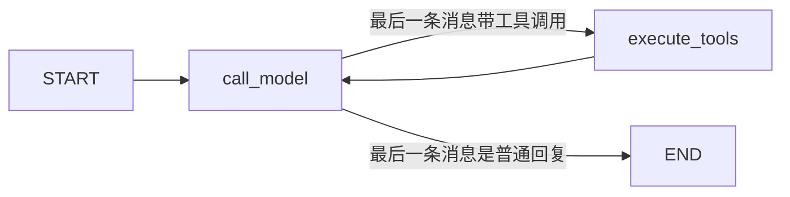

# 02 · GeoAgent 项目源码逐行解读

> 前提：先读完 [01-basics.md](./01-basics.md)。
> 本文逐文件解读 `backend/app/agent/graph/` 四个文件，读完你就能看懂
> GeoAgent 的 Agent 是怎么跑起来的，也知道怎么改。

---

## 0. 先看整体：这张图长什么样



循环保护（两把锁）：
1. **步数锁**：State 里的 `step` 计数，达到 `max_steps`（默认 3）就强制结束
2. **去重锁**：State 里的 `seen_calls` 集合，LLM 重复输出同一个工具调用就结束

对应四个文件：

| 文件 | 职责 | 类比 |
|---|---|---|
| `state.py` | 定义 State 长什么样 | 行李箱规格 |
| `nodes.py` | 定义每个站点做什么 | 站点功能 |
| `builder.py` | 把节点连成图并编译 | 画地铁图 |
| `runner.py` | 真正跑这张图（同步/流式） | 开车 |

---

## 1. state.py —— 状态定义（约 30 行）

文件：`backend/app/agent/graph/state.py`

```python
import operator
from dataclasses import dataclass
from typing import Annotated, Any, TypedDict
from app.llm.schemas import LLMMessage

@dataclass(frozen=True)
class ToolExecution:
    """一次已经完成的工具调用及其结构化结果。"""
    name: str
    args: dict[str, Any]
    result: dict[str, Any]

class AgentState(TypedDict):
    """LangGraph Agent 状态：消息流 + 执行记录 + 循环控制字段。"""
    messages: Annotated[list[LLMMessage], operator.add]   # ①
    executions: list[ToolExecution]                        # ②
    seen_calls: set[str]                                   # ③
    step: int                                              # ④
    reply: str                                             # ⑤
```

逐字段讲解：

- **① `messages`**：完整对话消息列表（system + user + assistant + tool）。
  标注了 `Annotated[list[LLMMessage], operator.add]` —— 这是 **Reducer**：
  「节点返回的新消息**追加**到历史，而不是覆盖」。
  因为 `call_model` 和 `execute_tools` 两个节点都会往消息里加内容，
  没有 Reducer 的话后一个节点会把前一个节点的成果抹掉。

  > 问：LangGraph 官方常用 `add_messages`，这里为什么用 `operator.add`？
  > 答：`add_messages` 是为 LangChain 的 `BaseMessage` 设计的（按 id 去重、转换格式），
  > 而项目用的是自己的 `LLMMessage`（Pydantic 模型）。`operator.add` 就是朴素的
  > 「列表拼接」，对我们自己的类型最简单、零转换。

- **② `executions`**：已执行的工具调用记录（工具名 + 参数 + 结果），
  最终要返回给前端展示「工具时间线」。没有 Reducer → **整体覆盖**（只有
  `execute_tools` 节点写它，覆盖没问题）。

- **③ `seen_calls`**：去重集合，存「工具名:参数JSON」签名。LLM 有时会反复输出
  同一个工具调用（模型抽风/上下文丢失），命中即视为死循环，强制结束。

- **④ `step`**：模型调用次数。`call_model` 每次 +1，达到上限（默认 3）强制结束。

- **⑤ `reply`**：最终回复文本。图结束时由 `call_model` 节点写入，runner 读取。

> 设计要点：**TypedDict 只是类型声明，不是实例**。运行时 LangGraph 会维护
> 一个普通字典作为真正的 State。你写节点函数时，`state["step"]` 就是取字典值。

---

## 2. nodes.py —— 节点实现（约 150 行）

文件：`backend/app/agent/graph/nodes.py`

### 2.1 为什么是「工厂函数」而不是普通函数？

普通节点函数是模块级函数，参数固定 `(state, config)`。
但 `call_model` 需要用到 `router`（LLM 路由）、`fallback_reply`（兜底回复）、
`max_steps`（步数上限）——这些是**构建图时确定、运行时不换**的依赖。

所以代码用**闭包（工厂函数）**：外层函数接收依赖，内层函数才是真正的节点。

```python
def make_call_model_node(router, fallback_reply, max_steps):
    """构造模型调用节点：外层收依赖，内层是节点。"""
    fallback = _fallback_factory(fallback_reply)   # 预加工一下

    def _node(state: AgentState, config: RunnableConfig) -> dict:
        # 这里才是节点本体，可以用到外层捕获的 router 等变量
        ...

    return _node   # 返回节点函数
```

> 相当于把「配置」和「逻辑」分开：配置在构建图时注入一次，逻辑在执行时运行。

### 2.2 call_model 节点：一次模型调用 + 三种终态判定

```python
def _node(state: AgentState, config: RunnableConfig) -> dict:
    step = state.get("step", 0)
    executions = state.get("executions", [])
    # 锁①：步数上限 → 直接给兜底回复
    if step >= max_steps:
        return {"reply": fallback(executions), "step": step + 1}

    messages = state["messages"]
    input_message = config["configurable"]["input_message"]   # 原始用户输入
    response = router.chat(messages, fallback_message=input_message)

    # 情况 A：LLM 没要调工具 → 给最终回复
    if not response.tool_calls:
        reply = response.text.strip() or fallback(executions)
        return {"reply": reply, "messages": [LLMMessage(role="assistant", content=reply)], "step": step + 1}

    # 锁②：工具调用与历史重复 → 判定死循环，兜底结束
    if _repeat_calls(response.tool_calls, state.get("seen_calls", set())):
        return {"reply": fallback(executions), "step": step + 1}

    # 情况 B：要调工具 → 产出带 tool_calls 的 assistant 消息，交给 execute_tools
    return {"messages": [LLMMessage(role="assistant", content=response.text, tool_calls=response.tool_calls)], "step": step + 1}
```

几个细节：

- **`config["configurable"]["input_message"]`**：节点拿不到 `run()` 的参数，
  所以 runner 把「本次请求的原始用户输入」塞进执行配置 `config`，节点从配置里取。
  （LangGraph 官方推荐用 `configurable` 传运行时依赖，如数据库会话、用户 ID。）
- **返回的 `messages` 只包含新增的那一条**：因为 State 里 `messages` 有
  `operator.add` Reducer，LangGraph 会自动把它**拼到历史后面**。
- **`step + 1`**：每次模型调用都 +1，包括最后那次兜底判定——保证任何路径
  都不会无限循环。

### 2.3 execute_tools 节点：执行工具并回填结果

```python
def _node(state: AgentState, config: RunnableConfig) -> dict:
    db = config["configurable"]["db"]            # 数据库会话从配置注入
    messages = list(state["messages"])
    calls = messages[-1].tool_calls              # 取最后一条 assistant 消息的工具调用
    tool_messages: list[LLMMessage] = []
    executions = list(state.get("executions", []))
    seen_calls = set(state.get("seen_calls", set()))

    for call in calls:
        tool = _require_tool(registry, call.name)          # 注册表校验
        result = tool.run(db, call.arguments)              # 执行工具
        executions.append(ToolExecution(name=call.name, args=call.arguments, result=result))
        seen_calls.add(_call_signature(call))              # 记录签名，供去重
        tool_messages.append(LLMMessage(
            role="tool", name=call.name, tool_call_id=call.id,
            content=json.dumps(result, ensure_ascii=False, default=str),
        ))

    return {"messages": tool_messages, "executions": executions, "seen_calls": seen_calls}
```

- 工具结果以 `role="tool"` 消息回填——这是 OpenAI 函数调用协议的要求：
  LLM 需要看到「它要的工具 → 工具的结果」成对出现，才能继续推理。
- `registry` 来自外层闭包（构建图时注入的工具注册表），`db` 来自 config（运行时注入）。
- 工具结果序列化成 JSON 字符串塞进消息内容，下一轮 LLM 调用时就能读到。

### 2.4 route_after_model：唯一的路由函数

```python
def route_after_model(state: AgentState) -> str:
    messages = state.get("messages", [])
    if messages and messages[-1].tool_calls:   # 最后一条是带工具调用的 assistant 消息
        return ROUTE_EXECUTE                    # "execute_tools"
    return ROUTE_END                            # "end"
```

判断依据很简单：**最后一条消息带不带工具调用**。
- 带 → 去执行工具
- 不带 → 结束（因为终态时 `reply` 字段已经写好了）

---

## 3. builder.py —— 图组装（约 45 行）

文件：`backend/app/agent/graph/builder.py`

```python
def build_agent_graph(registry, router, fallback_reply, max_steps=3):
    graph = StateGraph(AgentState)
    # 加节点
    graph.add_node("call_model", make_call_model_node(router, fallback_reply, max_steps))
    graph.add_node("execute_tools", make_execute_tools_node(registry))
    # 固定边：入口 → call_model
    graph.add_edge(START, "call_model")
    # 条件边：call_model 之后根据路由函数决定去向
    graph.add_conditional_edges(
        "call_model",
        route_after_model,
        {"execute_tools": "execute_tools", "end": END},
    )
    # 固定边：工具执行完 → 回到模型（形成循环）
    graph.add_edge("execute_tools", "call_model")
    return graph.compile()
```

对照 01 篇的骨架，几乎一模一样，只是节点换成了真实实现。

> 注意 `add_conditional_edges` 的第三个参数：路由函数返回的字符串
> （`"execute_tools"` / `"end"`）通过这张映射表翻译成真实目标
> （节点名 / `END` 哨兵）。

---

## 4. runner.py —— 执行器（约 150 行）

文件：`backend/app/agent/graph/runner.py`

### 4.1 两种执行方式

```python
class AgentRunner:
    def __init__(self, registry, router=None, fallback_reply=None, max_steps=3):
        ...
        self._graph = build_agent_graph(...)   # 编译一次，反复使用

    def run(self, db, message, history=None) -> AgentLoopResult:
        """同步执行：一口气跑完，返回最终结果。"""
        final_state = self._graph.invoke(self._input(message, history), self._config(db, message))
        return self._to_result(final_state)

    def iter_run(self, db, message, history=None):
        """流式执行：边跑边产出事件（供 SSE 推送前端）。"""
        for update in self._graph.stream(..., stream_mode="values"):
            ...
```

- `invoke(input, config)`：**一次性执行**，返回最终 State。适合非流式接口。
- `stream(input, config, stream_mode="values")`：**逐步执行**，每次 yield 一个
  节点跑完后的完整 State 快照。适合 SSE 流式。

### 4.2 流式事件还原：values 模式 + 差值对比

前端要的是事件序列：`tool_call → tool_result → text → done`。
`stream_mode="values"` 给的是「每一步的完整 State」。怎么还原成事件？

```python
prev_msg_count = 0
prev_exec_count = 0
for update in self._graph.stream(input, config, stream_mode="values"):
    final_state = update
    # 对比：这次比上次多了哪些消息？多了哪些执行记录？
    yield from self._diff_events(update, prev_msg_count, prev_exec_count)
    prev_msg_count = len(update.get("messages", []))
    prev_exec_count = len(update.get("executions", []))
```

```python
def _diff_events(update, prev_msg_count, prev_exec_count):
    events = []
    messages = update.get("messages", [])
    for msg in messages[prev_msg_count:]:        # 只取新增的消息
        if msg.role == "assistant":
            for call in msg.tool_calls:          # 新增的 assistant 消息带工具调用 → tool_call 事件
                events.append(AgentLoopEvent(kind="tool_call", name=call.name, args=call.arguments))
    executions = update.get("executions", [])
    for execution in executions[prev_exec_count:]:   # 新增的执行记录 → tool_result 事件
        events.append(AgentLoopEvent(kind="tool_result", name=execution.name, args=execution.args, result=execution.result))
    return events
```

核心技巧：**记录上一轮的列表长度，只处理新增的部分**。消息列表只增不减，
所以「长度差」就是「增量」。

> 为什么不用 `stream_mode="updates"`？updates 模式只给「每个节点返回的增量」，
> 拿不到完整 State；values 模式给完整 State，事件还原更稳。
> （03 篇会对比两种模式。）

### 4.3 输入与配置的组装

```python
def _input(self, message, history=None) -> dict:
    return {
        "messages": self._router.build_messages(message, history),  # system + 历史 + 用户消息
        "executions": [],
        "seen_calls": set(),
        "step": 0,
        "reply": "",
    }

def _config(self, db, message) -> dict:
    return {"configurable": {"db": db, "input_message": message}}
```

- `_input`：初始 State。注意 `messages` 要包含 system prompt 和对话历史——
  LLM 需要完整上下文。
- `_config`：本次请求的运行时依赖（数据库会话、原始输入）走 `configurable`。

---

## 5. 与旧实现（手写循环）的对比

重构前 `app/agent/loop.py` 是手写 `for step in range(max_steps)` 循环，
重构后变成图。行为完全一致（步数上限、去重、降级路由、事件序列），
但收益明显：

| 维度 | 手写循环 | LangGraph 图 |
|---|---|---|
| 流程可见性 | 藏在 while 里 | 图结构一目了然（builder.py） |
| 每一步的状态 | 局部变量 | 统一 State，可流式输出 |
| 扩展新节点 | 改循环体 | 加节点 + 改路由 |
| 循环保护 | 手写标志位 | State 字段 + 条件边，天然受控 |
| 可视化调试 | 无 | 可配 LangSmith / 手动画图 |

---

## 6. 你改代码时最常动的三个地方

1. **想加一个新工具**：改 `backend/app/agent/tools/` 加工具类，注册进
   `service.py` 的 `build_default_registry`。图不用动——`execute_tools`
   是通用的（遍历全部工具调用）。
2. **想改最大步数**：`service.py` 里 `AgentRunner(..., max_steps=3)`。
3. **想加一个新节点**（比如「记忆整理」）：nodes.py 写节点 → builder.py
   加节点和边 → 必要时加 State 字段。

下一篇 [03-advanced.md](./03-advanced.md) 深入 Reducer、stream 模式、循环控制。
