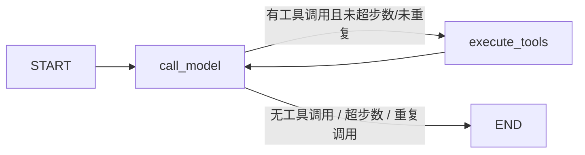

# LangGraph 学习指南（GeoAgent 实战版）

> 这份文档是为你从零学习 **LangGraph** 准备的，内容完全基于本项目的真实代码
> （`backend/app/agent/graph/`），学完你不仅能理解框架，还能看懂并修改 GeoAgent
> 的 Agent 编排逻辑。

## 学习路径（按顺序读）

| 顺序 | 文档 | 内容 | 适合谁 |
|---|---|---|---|
| 1 | [01-basics.md](./01-basics.md) | LangGraph 核心概念 + 从零写最小示例 | 完全没接触过的人 |
| 2 | [02-geoagent-walkthrough.md](./02-geoagent-walkthrough.md) | 本项目 `app/agent/graph/` 源码逐行解读 | 想读懂项目代码的人 |
| 3 | [03-advanced.md](./03-advanced.md) | Reducer / 流式 / 条件边 / 循环控制进阶 | 想深入原理的人 |
| 4 | [04-exercises.md](./04-exercises.md) | 动手练习（从简单到复杂，含答案要点） | 想巩固的人 |
| 5 | [05-faq.md](./05-faq.md) | 常见问题与排错 | 遇到坑的人 |

## 先知道三件事

1. **LangGraph 是什么**：一个把「AI Agent 的推理过程」画成**流程图**（有向图）并执行
   的框架。你的 Agent 每一步做什么、下一步去哪，都由图结构决定，代码清晰可维护。
2. **本项目为什么用它**：GeoAgent 的 Agent 原本是手写循环（LLM 调用 → 执行工具 →
   结果回填 → 再调用 LLM），逻辑散落在一个类里；改用 LangGraph 后，每一步都是图上的
   一个**节点**，流程一目了然，还能天然支持流式输出、循环上限、死循环保护。
3. **学习重点**：抓住 6 个词——**State（状态）、Node（节点）、Edge（边）、
   Conditional Edge（条件边）、Reducer（合并规则）、Compile（编译）**。
   概念就这么多，剩下的是组合技巧。

## 怎么运行示例代码

文档里的示例都是**独立可运行**的，在项目根目录执行：

```bash
cd backend
python -m pip install "langgraph>=0.4.0,<1.0.0"   # 已装过可跳过
```

然后把示例代码保存成 `demo.py`，运行：

```bash
python demo.py
```

> 所有示例只依赖 `langgraph`，不需要数据库、不需要 API Key，复制即跑。

## 本项目 Agent 图一图流



对应的代码位置：

| 概念 | 项目文件 |
|---|---|
| 状态定义 | `backend/app/agent/graph/state.py` |
| 节点实现 | `backend/app/agent/graph/nodes.py` |
| 图组装与编译 | `backend/app/agent/graph/builder.py` |
| 执行器（invoke / stream） | `backend/app/agent/graph/runner.py` |
| 图的使用方 | `backend/app/agent/service.py` |

## 参考

- 官方文档：<https://langchain-ai.github.io/langgraph/>
- 官方概念教程（英文）：<https://langchain-ai.github.io/langgraph/concepts/>
- 本项目安装的版本：`langgraph 0.6.x`（`backend/requirements.txt` 中为 `>=0.4.0,<1.0.0`）
