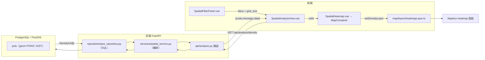

# Stage 2：PostGIS 空间能力建设

> 日期：2026-08-01
> 目标：在不破坏现有架构的基础上，新增空间分析能力，为 Agent Tool 层提供基础数据能力。
> 约束：不开发 Agent、不接入 LLM，本阶段只完成空间能力底座。

---

## 一、新增接口

所有接口统一返回 `{ code, message, data }` 外壳（`data` 结构见下）。

### 1. `GET /api/pois/spatial` — bbox 空间查询

按包围盒查询 POI，返回 **GeoJSON FeatureCollection**。

| 参数 | 类型 | 必填 | 说明 |
|---|---|---|---|
| `min_lon` / `min_lat` | float | ✅ | 包围盒最小经纬度（WGS84，范围校验） |
| `max_lon` / `max_lat` | float | ✅ | 包围盒最大经纬度（WGS84） |
| `category` | string | ❌ | 按类别精确筛选 |
| `limit` | int | ❌ | 默认 2000，上限 5000 |

要求 `min < max`，否则返回统一 422 格式。

```json
{
  "type": "FeatureCollection",
  "features": [
    {
      "type": "Feature",
      "geometry": { "type": "Point", "coordinates": [139.700, 35.680] },
      "properties": { "venue_id": "4abbe...", "category": "Coffee Shop", "name": "Central Coffee" }
    }
  ]
}
```

> `geometry.coordinates` 顺序为 **[longitude, latitude]**，可直接作为 Mapbox geojson source 的 data。

### 2. `GET /api/pois/nearby` — 半径查询

按中心点 + 半径（**米**）查询附近 POI，按距离升序。

| 参数 | 类型 | 必填 | 说明 |
|---|---|---|---|
| `longitude` / `latitude` | float | ✅ | 中心点（WGS84） |
| `radius_meter` | float | ✅ | 半径，单位米（>0，≤100km） |
| `category` | string | ❌ | 按类别精确筛选 |
| `limit` | int | ❌ | 默认 50，上限 200 |

```json
{
  "code": 0,
  "message": "success",
  "data": [
    {
      "venue_id": "4abbe...",
      "display_name": "Central Coffee",
      "venue_category": "Coffee Shop",
      "latitude": 35.680,
      "longitude": 139.700,
      "distance_m": 12.3
    }
  ]
}
```

> `distance_m` 为基于 geography 语义的精确球面距离（米）。

### 3. `GET /api/analysis/density` — 空间密度分析

把 bbox 切成 `grid_size × grid_size` 格网，统计每格 POI 数量，供 **Mapbox heatmap** 使用。

| 参数 | 类型 | 必填 | 说明 |
|---|---|---|---|
| `min_lon` / `min_lat` / `max_lon` / `max_lat` | float | ✅ | 包围盒 |
| `grid_size` | int | ❌ | 单边格网数，默认 10（2–100） |

```json
{
  "code": 0,
  "message": "success",
  "data": [
    { "lat": 35.680, "lon": 139.700, "count": 8 },
    { "lat": 35.685, "lon": 139.705, "count": 3 }
  ]
}
```

> 结果按 `count` 降序；每个元素是一个格点的中心坐标，前端直接转成 GeoJSON 点要素喂给 heatmap 图层。

---

## 二、PostGIS 函数说明

| 函数 | 用途 | 在本次的用法 |
|---|---|---|
| `ST_MakeEnvelope(minx, miny, maxx, maxy, srid)` | 用两个对角点构造矩形几何 | bbox 空间范围表达 |
| `ST_Intersects(geom, envelope)` | 几何相交判断 | bbox 过滤：`ST_Intersects(geom, ST_MakeEnvelope(...))` |
| `ST_AsGeoJSON` | 输出 GeoJSON 文本 | 接口直接由 ORM 字段组装 GeoJSON，无需该函数；若未来要原样透传几何可用它 |
| `ST_MakePoint(lng, lat)` | 由经纬度构造点 | 半径查询的中心点 |
| `ST_SetSRID(geom, 4326)` | 标注坐标系 | 确保中心点是 WGS84 |
| `ST_DWithin(geog, geog, radius)` | 距离阈值判断 | **geography 语义**：单位是米（4326 geometry 的 ST_DWithin 以度为单位，会出错） |
| `ST_Distance(geog, geog)` | 球面距离（米） | 半径结果附带 distance_m 并按距离排序 |
| `ST_SnapToGrid(geom, xsize, ysize)` | 坐标吸附到规则格网 | 密度分析：把 POI 吸附到格点后 COUNT + GROUP BY |
| `ST_X` / `ST_Y` | 取几何坐标 | 取格点经度/纬度 |

**两个关键点：**

1. **米制距离必须走 geography**：POI 表的 `geom` 是 `geometry(POINT, 4326)`，此时 `ST_DWithin` 以度为单位。
   Repository 通过 `CAST(geom AS geography(POINT,4326))` 转换后计算，保证 `radius_meter` 语义正确。
2. **索引**：现有 GIST 索引建在 `geom`（geometry）上，geography 计算时不会直接命中。
   当前东京 POI 量级（数千行）下顺序扫描足够快；若数据量增长，
   可后续为 `(geom::geography)` 建表达式 GIST 索引（见 stage2_report 遗留项）。

---

## 三、数据流图



**分层职责（本次强制约束）：**

| 层 | 职责 | 禁止 |
|---|---|---|
| `api/` 路由 | 参数校验（Query 范围）、调用 service、包 ApiResponse | ❌ 直接写 SQL |
| `services/` 编排 | bbox 合法性校验、调用 repository、组装响应模型 | ❌ 出现 ST_* 函数 |
| `repositories/` | 唯一接触 PostGIS 函数的地方 | ❌ 业务判断 |
| `map/layers/` | 图层 source/layer 定义与数据更新，独立于 useMap | ❌ 生命周期管理 |

---

## 四、如何被 Agent Tool 调用（Stage 3 预留）

本阶段只提供能力底座，**不实现 Agent**。以下为 Stage 3 工具层的调用契约设计：

```python
# 未来 app/agent/tools/spatial_tools.py（设计示意，未实现）
from app.repositories.poi_repository import query_by_bbox, query_by_radius, query_density_grid

class QueryPOITool:
    """按空间范围查 POI：Agent 问『涩谷的咖啡店』→ bbox + category → GeoJSON 特征集合。"""
    def run(self, db, bbox: dict, category: str | None = None) -> FeatureCollection:
        return spatial_service.get_pois_in_bbox(db, **bbox, category=category)

class NearbyQueryTool:
    """按半径查 POI：Agent 问『离这里 500 米内有什么』→ distance_m 排序结果。"""
    def run(self, db, longitude: float, latitude: float, radius_meter: float) -> list[NearbyPoi]:
        return spatial_service.get_nearby_pois(db, longitude, latitude, radius_meter)

class SpatialAnalysisTool:
    """密度分析：Agent 问『哪里 POI 最密集』→ 格网密度，可渲染 heatmap 或给出 Top 热区。"""
    def run(self, db, bbox: dict, grid_size: int = 10) -> list[DensityCellResponse]:
        return spatial_service.get_density_grid(db, **bbox, grid_size=grid_size)
```

**Agent 渲染指令 → 前端图层的桥梁**（对应 `map/layers/heatmapLayer.ts`）：
Agent 返回密度格网 → 前端 `setDensityLayer(cells)` → heatmap 图层渲染。
该调用链在 Stage 2 已由空间分析页面完整跑通，Agent 接入后直接复用。

---

## 五、验证结果

- 后端：`python -m pytest` → **35 passed**（含本阶段新增 13 例：bbox / radius / density / GeoJSON 格式 / 422 统一格式）
- 前端：`npm run lint` → 0 问题；`npm run build` → vue-tsc + vite 通过
- 全量回归：原有 22 例接口测试全部保持通过，无业务逻辑变更
