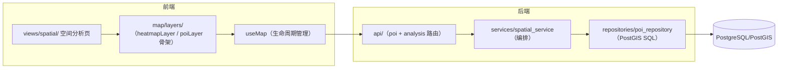

# 第二阶段报告：PostGIS 空间能力建设（Stage 2 Report）

> 日期：2026-08-01
> 目标：新增空间分析能力底座（bbox / 半径 / 密度），为 Agent Tool 层提供数据能力。
> 约束：不改变已有业务逻辑；每完成一个模块运行测试确认；修改记录于 docs/changelog.md；不开发 Agent。

---

## 一、修改文件列表

### 后端（4 个）

| 文件 | 说明 |
|---|---|
| `backend/app/api/poi.py` | 新增 `/spatial`、`/nearby` 两个空间查询路由（注册在 `/{poi_id}` 之前，避免路径冲突） |
| `backend/app/api/analysis.py`（新增） | 空间分析路由组：`GET /api/analysis/density` |
| `backend/app/main.py` | 注册 analysis 路由；版本 0.3.0 → 0.4.0 |
| `backend/tests/test_spatial_api.py`（新增） | 空间接口测试 13 例 |

### 前端（8 个）

| 文件 | 说明 |
|---|---|
| `frontend/src/map/layers/poiLayer.ts`（新增） | POI 图层骨架：图层 ID 常量（Stage 3 将迁移完整图层逻辑） |
| `frontend/src/map/layers/heatmapLayer.ts`（新增） | 密度热力图层：source/layer 注册 + setData/清空，独立于 useMap |
| `frontend/src/composables/useMap.ts` | 接入 heatmapLayer / poiLayer；新增 `setDensityLayer` / `clearDensityLayer` 并保持生命周期管理 |
| `frontend/src/components/map/MapContainer.vue` | expose 新增 `setDensityLayer` / `clearDensityLayer` |
| `frontend/src/types/spatial.ts`（新增） | Bbox / DensityCell / NearbyPoi / GeoJSON 类型 |
| `frontend/src/api/spatial.ts`（新增） | 三个空间接口的 axios 封装 |
| `frontend/src/views/spatial/SpatialAnalysisView.vue`（新增） | 空间分析测试页（105 行） |
| `frontend/src/views/spatial/components/SpatialFilterPanel.vue`（新增） | 区域预设 + 格网精度选择（65 行） |
| `frontend/src/views/spatial/components/SpatialHeatmap.vue`（新增） | 热力图渲染组件（24 行） |
| `frontend/src/router/index.ts` | 新增 `/spatial` 路由（懒加载） |
| `frontend/src/components/common/AppShell.vue` | 导航新增「空间分析」 |

### 文档（4 个）

| 文件 | 说明 |
|---|---|
| `docs/stage2_postgis.md`（新增） | 空间能力技术文档（接口 / PostGIS 函数 / 数据流 / Agent 调用契约） |
| `docs/stage2_report.md`（新增） | 本报告 |
| `docs/changelog.md` | 追加 Stage 2 变更记录 |
| `README.md` | API 一览 + 目录结构更新 |

## 二、新增文件列表（按层归类）

```text
backend/app/
  repositories/poi_repository.py     # Repository 层（首次引入）：query_by_bbox / query_by_radius / query_density_grid
  schemas/spatial.py                 # GeoJSON FeatureCollection / NearbyPoi / DensityCellResponse
  services/spatial_service.py        # 空间分析编排层（参数校验 + 组装，不含 SQL）
  api/analysis.py                    # /api/analysis 路由组

frontend/src/
  map/layers/poiLayer.ts             # POI 图层骨架（ID 常量）
  map/layers/heatmapLayer.ts         # 密度热力图层（完整实现）
  types/spatial.ts                   # 空间分析类型
  api/spatial.ts                     # 空间接口封装
  views/spatial/SpatialAnalysisView.vue
  views/spatial/components/SpatialFilterPanel.vue
  views/spatial/components/SpatialHeatmap.vue
```

## 三、测试结果（2026-08-01 实测）

### 后端 pytest

```
cd backend && python -m pytest
35 passed, 1 warning in 2.30s   （warning 为 Starlette httpx 弃用提示，与上阶段相同）
```

本阶段新增 13 例（`test_spatial_api.py`）：

| 用例组 | 数量 | 覆盖内容 |
|---|---|---|
| bbox 查询 | 6 | 全量命中 / 范围过滤 / 类别组合 / GeoJSON 格式正确性（type、coordinates=[lon,lat]、properties）/ 非法 bbox 422 / 缺参 422 |
| 半径查询 | 4 | 小半径仅自身（distance≈0）/ 距离升序 + 半径内 / 类别组合 / 非法半径 422 |
| 密度分析 | 3 | 格网计数守恒（4 POI → 4 格，sum=4）/ 字段 {lat, lon, count} / 非法 bbox 422 |

回归：原有 22 例接口测试全部保持通过 —— **无业务逻辑变更**。

### 前端

```
npm run lint   → 0 errors, 0 warnings ✅
npm run build  → vue-tsc 类型检查通过 + vite 构建成功 ✅
```

代码规范自检：所有新增/修改文件均 <300 行（useMap.ts 293 行为全项目最大），
普通函数 <100 行，router/service/repository 分层中 SQL 只出现在 repository。

## 四、架构变化



1. **首次引入 Repository 层**：空间 SQL 全部收敛到 `repositories/poi_repository.py`，
   service 只做校验与组装 —— 新增四层约束：路由不写 SQL、service 不出现 ST_*。
2. **新增 `map/layers/` 图层模块**：heatmapLayer 独立实现（source/layer 定义 + 数据更新），
   useMap 只负责注册时机与生命周期，为后续 Agent 渲染指令复用图层能力做铺垫。
3. **新路由组 `/api/analysis`**：空间分析类接口有独立挂载点，后续聚类/热区接口在此扩展。
4. **米制距离语义**：半径查询走 `geography` 转换，`distance_m` 为球面真实米数。

## 五、遗留已知项与下一阶段建议

| # | 事项 | 说明 | 预估 |
|---|---|---|---|
| 1 | **Agent Tool 层 + 聊天入口** | Stage 2 已铺好全部数据前提（bbox/radius/density 接口 + heatmap 图层 + GeoJSON 契约）；设计见 stage2_postgis.md 第四节 | 2 周 |
| 2 | `(geom::geography)` 表达式索引 | 数据量大后半径查询的加速项，当前量级无需 | 0.5 天 |
| 3 | 空间聚类（DBSCAN / ST_ClusterDBSCAN） | 密度分析的进阶能力，可作为 Agent 的「热区识别」工具 | 2 天 |
| 4 | **引入 Alembic** | 现有迁移 SQL 纳入版本管理；Agent 新增表的前置条件 | 1 天 |
| 5 | useMap 中 POI/轨迹图层迁移到 `map/layers/` | poiLayer 骨架已就位，下一阶段将完整迁移 | 1 天 |

详细升级设计见 `docs/project_audit.md` 第五、六节与 `docs/stage2_postgis.md`。
