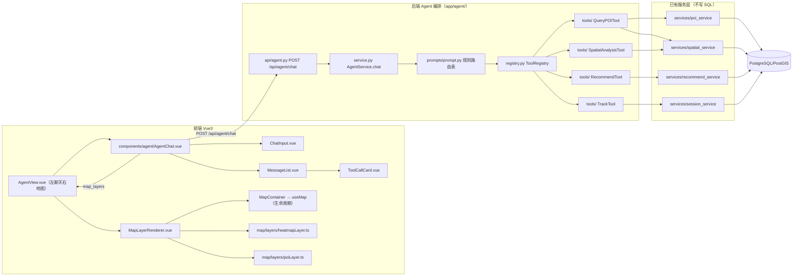

# 第三阶段报告：Agent Tool Calling 层（Stage 3 Report）

> 日期：2026-08-01
> 目标：新增轻量 Agent 编排层，让用户通过自然语言调用已有空间分析能力。
> 方案：Intent Routing + Tool Registry。禁止 LangChain / Multi Agent / ReAct / MCP / 向量数据库。

---

## 一、架构图



**闭环**：自然语言 → `AgentService.chat()` → 规则路由选 Tool → Tool 调 service → 结构化结果 → 回复文本 + `map_layers` → 前端 `MapLayerRenderer` 分派到 heatmapLayer / poiLayer 渲染。

## 二、Tool 设计

统一接口 `AgentTool`（[registry.py](../backend/app/agent/registry.py)）：

| 成员 | 说明 |
|---|---|
| `name` | 工具唯一名（路由与调用记录用） |
| `description` | 工具用途描述 |
| `parameters` | JSON Schema 参数声明（**未来 LLM Function Calling 直接复用**） |
| `validate(args)` | 轻量校验：必需字段存在 + 基本类型，非法抛 ValueError → 统一 422 |
| `run(db, args)` | 参数验证 → 调用 service → 返回结构化结果 |

**约束**：Tool 内不出现任何 SQL / ST_* 函数，全部委托 service 层。

| 工具 | name | 调用的 service | 输入 | 结构化结果 |
|---|---|---|---|---|
| QueryPOITool | `query_poi` | poi_service（类别）、spatial_service（bbox） | category / bbox | poi_list 或 GeoJSON feature_collection |
| SpatialAnalysisTool | `spatial_density` | spatial_service.get_density_grid | bbox（必填）、grid_size | cells[{lat,lon,count}] + count |
| RecommendTool | `recommend` | recommend_service | user_id / session_id / top_k（缺省取最近会话） | candidates（含 rank/score） |
| TrackTool | `track` | session_service + user_service | user_id / session_id（缺省取最近会话） | points（与轨迹接口同构） |

## 三、调用流程

```
用户输入 "帮我找咖啡店"
  ↓ _route_intent（prompts/prompt.py 规则表）
  [1] 类别关键词命中：「咖啡店」→ category="Coffee Shop"
  [2] 意图关键词：密度/热力/空间分布 → spatial_density（带默认东京中心 bbox）
  [3] 「附近」→ query_poi（带默认 bbox）
  [4] 全部未命中 → 兜底回复（列能力清单，不调工具）
  ↓ 注册表选择 Tool
  ↓ Tool.run(db, args) → service → PostgreSQL/PostGIS
  ↓ build_reply / build_map_layers
  返回 {reply, tool_calls:[{tool,args}], map_layers:[{type,data}]}
```

**意图优先级**：类别关键词（具体实体）> 意图关键词 > 「附近」 > 兜底。

**规则路由可扩展性**：新增意图只需在 `prompts/prompt.py` 的 `CATEGORY_KEYWORDS` / `INTENT_KEYWORDS` 增加一行；新增能力只需实现一个 AgentTool 子类并注册。

**LLM 预留**：`parameters` 已是 JSON Schema，`SYSTEM_PROMPT` 已写好系统提示词 —— 未来把 `_route_intent` 替换为 Function Calling 调用即可，Service/Registry/前端全链路不动。

## 四、接口

`POST /api/agent/chat`（统一 `{code, message, data}` 外壳内层）：

```json
// 请求
{ "message": "帮我找咖啡店" }

// 响应 data
{
  "reply": "共找到 1 个 POI（类别：Coffee Shop）：Central Coffee。地图已标注点位。",
  "tool_calls": [{ "tool": "query_poi", "args": { "category": "Coffee Shop" } }],
  "map_layers": [
    {
      "type": "poi",
      "data": [
        { "venue_id": "poi_coffee", "display_name": "Central Coffee",
          "venue_category": "Coffee Shop", "latitude": 35.68, "longitude": 139.7 }
      ]
    }
  ]
}
```

## 五、测试结果（2026-08-01 实测）

### 后端 pytest

```
cd backend && python -m pytest
41 passed, 1 warning in 2.54s
```

本阶段新增 6 例（`test_agent_api.py`）：

| 用例 | 断言 |
|---|---|
| 咖啡店查询 | 路由到 query_poi、args.category 正确、poi 图层含 poi_coffee、回复含结果 |
| 密度分析 | 路由到 spatial_density、heatmap 图层、单元格字段 {lat, lon, count} |
| 推荐查询 | 路由到 recommend、poi 图层 3 个候选、含 rank/score、回复 Top |
| 轨迹查询 | 路由到 track、trajectory 图层 3 个点、含 sequence_no |
| 兜底 | 未识别意图 → 无工具调用、无图层、回复含能力清单 |
| 空消息 | 统一 422 格式 |

回归：原有 35 例（Stage 1 + Stage 2）全部保持通过。

### 前端

```
npm run lint   → 0 errors, 0 warnings ✅
npm run build  → vue-tsc 通过 + vite 构建成功 ✅
```

代码规范自检：agent 模块最大文件 service.py 178 行，前端组件全部 <70 行。

## 六、修改/新增文件

### 后端新增（10 个）

| 文件 | 说明 |
|---|---|
| `backend/app/agent/__init__.py` | 包初始化 |
| `backend/app/agent/schemas.py` | ChatRequest / ToolCallInfo / MapLayer / ChatResponse |
| `backend/app/agent/registry.py` | AgentTool 统一接口 + ToolRegistry 注册表 |
| `backend/app/agent/service.py` | AgentService.chat 编排 + 意图路由 + 回复/图层组装 |
| `backend/app/agent/prompts/__init__.py` + `prompt.py` | 关键词规则表 + 回复模板 + SYSTEM_PROMPT 预留 |
| `backend/app/agent/tools/__init__.py` + `poi_tool.py` / `spatial_tool.py` / `recommend_tool.py` / `track_tool.py` | 4 个工具 |
| `backend/app/api/agent.py` | POST /api/agent/chat |
| `backend/tests/test_agent_api.py` | 6 例接口测试 |

### 后端修改（1 个）

`backend/app/main.py`：注册 agent 路由（prefix=/api/agent）；版本 0.4.0 → 0.5.0。

### 前端新增（8 个）

| 文件 | 说明 |
|---|---|
| `frontend/src/types/agent.ts` | Agent 类型 |
| `frontend/src/api/agent.ts` | sendAgentMessage |
| `frontend/src/components/agent/AgentChat.vue` | 聊天编排（消息状态 + API 调用 + 图层上抛） |
| `frontend/src/components/agent/ChatInput.vue` | 输入框 |
| `frontend/src/components/agent/MessageList.vue` | 消息列表 |
| `frontend/src/components/agent/ToolCallCard.vue` | 工具调用记录卡片（参数可展开） |
| `frontend/src/components/map/MapLayerRenderer.vue` | map_layers → 图层分派渲染 |
| `frontend/src/views/agent/AgentView.vue` | 左聊天右地图页面 |

### 前端修改（2 个）

`frontend/src/router/index.ts`（/agent 路由）、`frontend/src/components/common/AppShell.vue`（导航「Agent 对话」）。

## 七、下一阶段建议

| # | 事项 | 说明 | 预估 |
|---|---|---|---|
| 1 | **LLM Function Calling 接入** | 替换 `_route_intent` 为 LLM 函数调用；工具 parameters/SYSTEM_PROMPT 已就绪 | 2-3 天 |
| 2 | 对话记忆（多轮上下文） | 当前每轮独立，无记忆；可在 AgentService 增加会话级 context | 1-2 天 |
| 3 | 工具参数位置提取 | 「涩谷的咖啡店」→ 自动解析 bbox；规则抽取或交给 LLM | 视方案 |
| 4 | 引入 Alembic | 迁移 SQL 纳入版本管理 | 1 天 |
| 5 | useMap 图层完整迁移到 map/layers/ | poiLayer 骨架已就位 | 1 天 |
