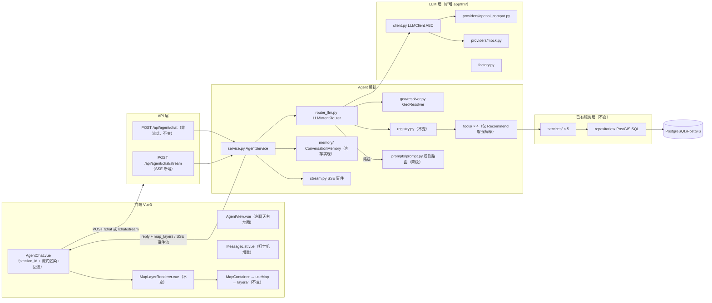

# 第四阶段报告：LLM Function Calling Agent（Stage 4 Report）

> 日期：2026-08-01
> 目标：将 Stage 3 规则路由 Agent 升级为 LLM Function Calling Agent，保留 Tool/Service/Repository/前端全链路。
> 方案：LLMClient 抽象（OpenAI 兼容 + Mock）+ LLMIntentRouter + GeoResolver + Memory 抽象 + SSE 流式。
> 禁止项（全程遵守）：无 LangChain / Multi Agent / ReAct / MCP / 向量数据库。

---

## 一、架构图（目标态已实现）



**数据流（LLM 路径）**：用户输入 → `LLMIntentRouter`（system + tools schema + 多轮历史 → LLM → tool_call）→ GeoResolver 把 location 解析为 bbox → Tool.validate + run → service → 数据库 → 回复模板 + map_layers → 前端渲染。LLM 不可用 / 输出非法（重试 1 次）→ 规则路由，与 Stage 3 完全同路径。

## 二、三个架构调整（评审新增）

| 调整 | 实现 | 说明 |
|---|---|---|
| **GeoResolver** | `agent/geo/resolver.py` | LLM 只输出地点名（如 涩谷 / Shibuya），schema 对 LLM 隐藏 bbox；`geo_resolver.resolve(location)` 内置东京地名词典（涩谷/新宿/银座/浅草/池袋/东京中心），未收录地点回退默认东京中心。未来替换真实地理编码服务只需保持 `resolve()` 接口 |
| **Memory 抽象** | `agent/memory/`（base.py ABC + memory.py 内存实现） | `ConversationMemory.get/append/clear(session_id)`；`AgentService` 通过接口存取最近 8 轮历史，不直接维护 dict。未来替换 Redis 只需新写实现 |
| **推荐解释增强** | `tools/recommend_tool.py` `_explain_candidates` | 候选新增 `feature`（rank/score/category 结构化）+ `reason`（基于真实信号：Top-1 分数、与用户历史访问类别关联、个性化预测）；回复模板附加 Top-1 推荐理由 |

## 三、模块设计

### LLM 层（`app/llm/`，全部新增）

| 文件 | 职责 |
|---|---|
| `schemas.py` | LLMMessage / LLMToolCall / LLMResponse 统一数据结构（与厂商格式解耦） |
| `client.py` | LLMClient ABC：`complete()` 抽象 + `stream()` 默认回退 + `is_available()` |
| `factory.py` | `get_llm_client()` 按 `settings.llm_provider` 懒加载单例 |
| `providers/mock.py` | 规则路由模拟 LLM（把 `_route_intent` 包装成 LLMResponse）→ 无 key 离线闭环 |
| `providers/openai_compat.py` | openai SDK + 可配 base_url，兼容 OpenAI / DeepSeek / Moonshot / Qwen 等；真流式 `stream()` |

### 编排层改造

| 文件 | 变更 |
|---|---|
| `agent/router_llm.py`（新增） | `LLMIntentRouter.route(message, history)`：prompt 组装 → tools schema（空间工具隐藏 bbox、暴露 location）→ LLM → `_parse` 校验工具名 → GeoResolver 解析 → Intent；LLM 不可用/异常/非法输出 → 规则路由 |
| `agent/stream.py`（新增） | ChatStreamEvent + `sse_format`（datetime 兜底）+ `chunk_text`（打字机切块）+ `tool_result_summary`（业务摘要，不含内部细节） |
| `agent/service.py` | `chat()` 接入 router + memory；新增 `chat_stream()` 编排（tool_call → tool_result → text → done，终态含 reply/tool_calls/map_layers） |
| `agent/prompts/prompt.py` | 规则路由表 + `Intent(text)` 迁移至此（降级路径 + MockProvider 复用）；SYSTEM_PROMPT 保留 |
| `agent/schemas.py` | ChatRequest 增加可选 `session_id`（多轮记忆） |
| `api/agent.py` | 新增 `POST /chat/stream`（SSE）；非流式端点不变 |
| `core/config.py` | 新增 `llm_provider / llm_base_url / llm_api_key / llm_model / llm_timeout` |

### 前端（渲染链路零改动）

| 文件 | 变更 |
|---|---|
| `api/agent.ts` | `sendAgentMessage` 带 session_id；新增 `sendAgentMessageStream`（fetch + ReadableStream 解析 SSE，POST 无法用 EventSource） |
| `AgentChat.vue` | `crypto.randomUUID()` 会话 ID；reactive assistant 消息流式增量（打字机 + 实时 ToolCallCard）；流式失败自动回退非流式 |

**明确不动**：MapLayerRenderer / MapContainer / useMap / map/layers/、全部 services/、全部 repositories/、registry.py 核心、4 个工具的 schema 与行为（仅 recommend 附加解释字段）。

## 四、Function Calling 数据流

```
用户输入 "涩谷的咖啡店"
  ↓ LLMIntentRouter：SYSTEM_PROMPT + 4 个函数声明 + 多轮历史 + user
  ↓ LLM（Mock 或 OpenAI 兼容）→ tool_call: query_poi {category, location: "涩谷"}
  ↓ _parse：工具名白名单校验（非法 → 重试 1 次 → 规则路由）
  ↓ GeoResolver.resolve("涩谷") → bbox {139.695, 35.655, 139.715, 35.665}
  ↓ Intent(tool="query_poi", args={category, bbox})
  ↓ Tool.validate（白名单 + 类型）→ run → spatial_service → PostGIS
  ↓ build_reply / build_map_layers → {reply, tool_calls, map_layers}
```

**LLM 输入**：system prompt + tools schema（OpenAI function 格式，见 stage4_llm_design.md 第二节）+ history + user。
**LLM 输出**：`tool_call{name, arguments}` 或直接文本。多轮上下文通过 Memory 注入 history。

## 五、安全防线（实现确认）

| 威胁 | 防线 |
|---|---|
| LLM 生成非法参数 | Tool.validate 白名单过滤 + 类型检查；JSON 解析失败 → ValueError → 重试 → 降级 |
| LLM 越权调用 | 工具名白名单校验（未注册 → 重试→降级）；全部工具只读；tool_result 只回传业务摘要 |
| LLM 直接生成坐标 | schema 对 LLM 只暴露 location，bbox 由 GeoResolver 服务端解析；未收录地点回退默认东京中心 |
| 错误空间范围 | spatial_service bbox 合法性校验（已有 422）；规则路由降级保证结果合法 |
| 调用失败 | 重试 1 次 → 规则路由 → 兜底模板，闭环永不中断 |

## 六、测试结果（2026-08-01 实测）

### 后端 pytest：78 passed

```
cd backend && python -m pytest
78 passed, 1 warning in 4.76s
```

Stage 4 新增 37 例：

| 文件 | 覆盖 |
|---|---|
| `test_llm_client.py`（+11） | MockProvider 路由/兜底/多轮取最后消息；Factory 默认 mock；OpenAI 兼容：availability / tool_call 解析 / 文本 / 非法 JSON 抛错（monkeypatch 不联网） |
| `test_agent_llm_api.py`（+15） | Router：非法工具名降级、不可用客户端走规则、文本 Intent、tools schema 函数格式、system+user 消息组装；推荐解释字段（feature/reason + Top-1 分数）；SSE：事件序列、text 增量拼接 = 终态 reply、无工具场景、空消息 422 |
| `test_agent_geo.py`（+9） | GeoResolver：已收录/英文别名/东京默认/未知地点 None；Router location→bbox 解析、密度缺位置回退默认、未知地点回退；schema 隐藏 bbox 暴露 location、非空间工具 schema 不变 |
| `test_memory.py`（+2） | Memory：append/get/clear/截断；带 session_id 对话写入记忆（API 级） |

回归：Stage 1（22）+ Stage 2（13）+ Stage 3（6）全部保持通过；原 Agent 测试已自动走 LLM 链路（默认 provider=mock）。

### 前端

```
npm run lint   → 0 errors, 0 warnings ✅
npm run build  → vue-tsc 通过 + vite 构建成功 ✅
```

代码规范自检：最大文件 `llm/providers/openai_compat.py` 86 行、`agent/service.py` 254 行，全部 <300 行；所有函数 <100 行。

## 七、接口

### POST /api/agent/chat（不变，新增可选字段）

```json
// 请求
{ "message": "涩谷的咖啡店", "session_id": "abc-123" }

// 响应 data（与 Stage 3 契约一致）
{
  "reply": "共找到 1 个 POI（类别：Coffee Shop）：Central Coffee。地图已标注点位。",
  "tool_calls": [{ "tool": "query_poi", "args": { "category": "Coffee Shop", "bbox": {...} } }],
  "map_layers": [{ "type": "poi", "data": [...] }]
}
```

### POST /api/agent/chat/stream（SSE 新增）

```
event: tool_call     data: {"tool":"query_poi","args":{...}}
event: tool_result   data: {"count":1}
event: text          data: {"content":"共找到 1 个 POI（类"}
event: text          data: {"content":"别：Coffee Shop）：..."}
event: done          data: {"reply":"...","tool_calls":[...],"map_layers":[...]}
```

## 八、配置（backend/.env）

```env
# LLM Provider：mock（默认，离线规则模拟）或 openai_compat
LLM_PROVIDER=mock
# openai_compat 时配置：
LLM_BASE_URL=https://api.openai.com/v1    # 或任意 OpenAI 兼容端点（DeepSeek/Moonshot 等）
LLM_API_KEY=sk-xxx
LLM_MODEL=gpt-4o-mini
```

## 九、修改/新增文件

### 后端新增（15）

`app/llm/__init__.py`、`llm/schemas.py`、`llm/client.py`、`llm/factory.py`、`llm/providers/__init__.py`、`llm/providers/mock.py`、`llm/providers/openai_compat.py`、`agent/router_llm.py`、`agent/stream.py`、`agent/geo/__init__.py`、`agent/geo/resolver.py`、`agent/memory/__init__.py`、`agent/memory/base.py`、`agent/memory/memory.py`、`tests/test_agent_geo.py`。

### 后端修改（8）

`core/config.py`（LLM 配置）、`agent/service.py`（router + memory + chat_stream）、`agent/prompts/prompt.py`（Intent + 规则路由迁移）、`agent/schemas.py`（session_id）、`agent/tools/recommend_tool.py`（解释字段）、`api/agent.py`（SSE 端点）、`requirements.txt`（+openai）、`tests/test_llm_client.py` / `test_agent_llm_api.py` / `test_memory.py`（扩充）。

### 前端修改（2）

`api/agent.ts`（流式封装）、`components/agent/AgentChat.vue`（流式渲染 + session_id + 回退）。

### 文档

`docs/stage4_llm_design.md`（设计稿，评审通过）、本报告、`docs/changelog.md`、`README.md`。

## 十、下一阶段建议

| # | 事项 | 说明 | 预估 |
|---|---|---|---|
| 1 | 真实 LLM 总结回复 | 工具执行后二次 LLM 调用生成自由文本总结（当前为模板回复 + 流式打字机） | 1 天 |
| 2 | 位置抽取增强 | GeoResolver 接入真实地理编码（Nominatim 等），替换内置词典 | 1-2 天 |
| 3 | Memory 持久化 | Redis 实现（接口已抽象，零侵入替换） | 0.5-1 天 |
| 4 | 多工具单轮组合 | 单轮多次工具调用（如"轨迹 + 密度"一次完成） | 1 天 |
| 5 | Alembic / useMap 图层迁移 | 延续既有 backlog | 各 1 天 |
